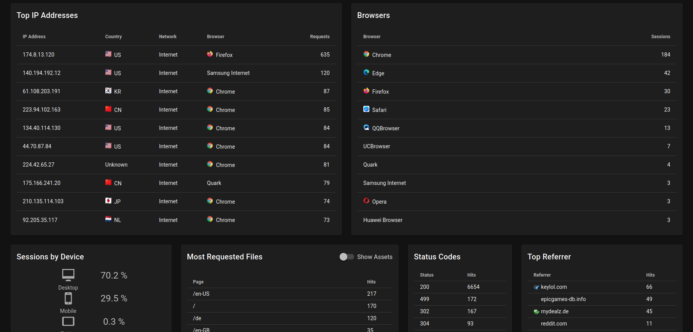
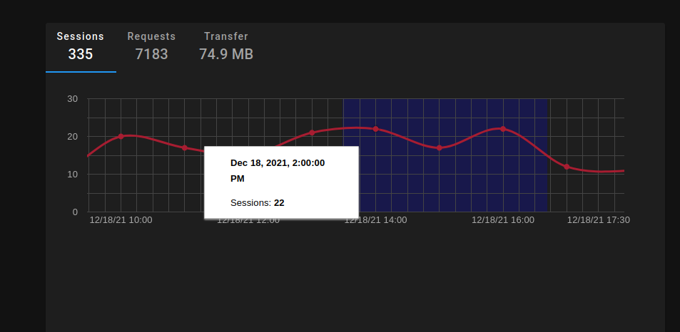
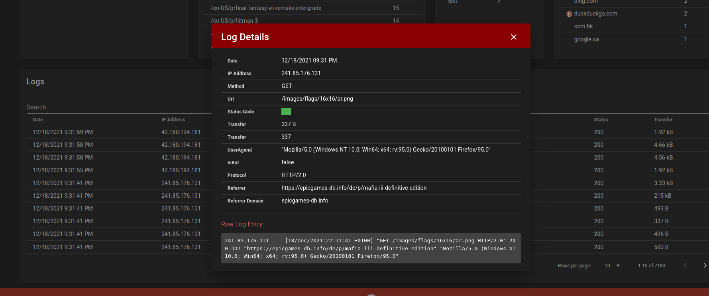
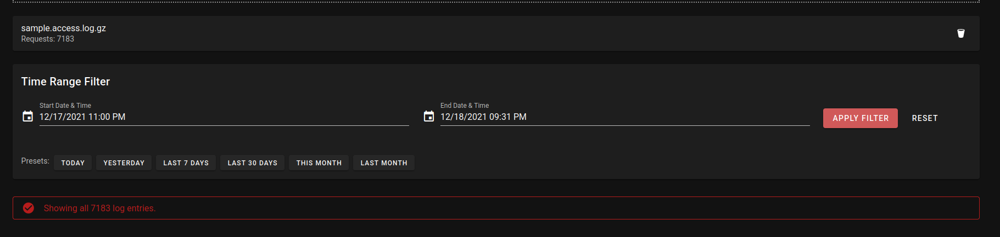

# Access Log Viewer

A fork of the access-log-viewer with features on top of the original to help security investigations.






## Roadmap

- [ ] Add exception list (ex. health checks and liveness probes).

## Features

### Visitors

Determine the amount of hits, visitors, bandwidth by the hour, or date.

### Geographical Data

Determine the visitors originating country.

### Device Data

Determine the browser and device type like desktop or mobile.

### Referral-Traffic

Determine referring websites that send traffic to your websites via direct links.

### Most Requested Files

Determine the urls with the most hits.

### Status Codes

Determine how often your server respondet with 200, 404, 500, ...  status codes.

## Docker Usage

You can run this application using Docker:

### Build the Docker image

```bash
docker build -t access-log-viewer .
```

### Run the Docker container

```bash
docker run -p 8080:8080 access-log-viewer
```

If port 8080 is already in use, you can use a different port:

```bash
docker run -p 8081:8080 access-log-viewer
```

After running these commands, you can access the application at <http://localhost:8080> (or <http://localhost:8081> if you used the alternative port)

### Development with Docker

For development with hot-reloading, you can use this command:

```bash
docker run -it --rm -v $(pwd):/app -p 8080:8080 -e NODE_OPTIONS=--openssl-legacy-provider node:18 sh -c "cd /app && npm install && npm run serve"
```

This command:

- Mounts the current directory into the container
- Installs dependencies
- Runs the development server with hot-reloading
- Exposes the app on port 8080

#### Using Docker Compose for Development

Alternatively, you can use Docker Compose for an even more convenient development setup. Create a file named `docker-compose.dev.yml` with the following content:

```yaml
services:
  app:
    image: node:18
    working_dir: /app
    command: sh -c "npm install && npm run serve"
    ports:
      - "8080:8080"
    volumes:
      - .:/app
    environment:
      - NODE_OPTIONS=--openssl-legacy-provider
```

Then run:

```bash
docker-compose -f docker-compose.dev.yml up
```

You can now edit files locally and see changes immediately reflected in the browser.

### Quick Start Commands

For convenience, here are the most common commands for development:

```bash
# Start development server
docker-compose -f docker-compose.dev.yml up

# Start in detached mode (background)
docker-compose -f docker-compose.dev.yml up -d

# Stop development server
docker-compose -f docker-compose.dev.yml down

# View logs when running in detached mode
docker-compose -f docker-compose.dev.yml logs -f
```

#### Using the dev.sh Script

For an even simpler development experience, you can use the included `dev.sh` script:

```bash
# Make the script executable (first time only)
chmod +x dev.sh

# Start development server
./dev.sh

# Stop development server
./dev.sh down

# Start in detached mode (background)
./dev.sh detach

# View logs
./dev.sh logs

# Show help
./dev.sh help
```

The development server features:

- Hot-reloading when you make changes to the code
- Source maps for easy debugging
- Automatic browser refresh

### Note

The application has been modified to use the first column for IP addresses in log files rather than automatically detecting them.
